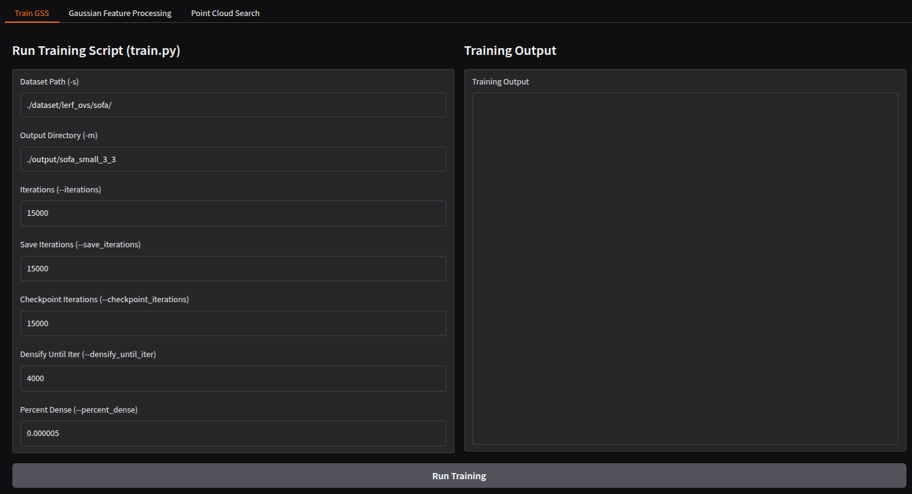
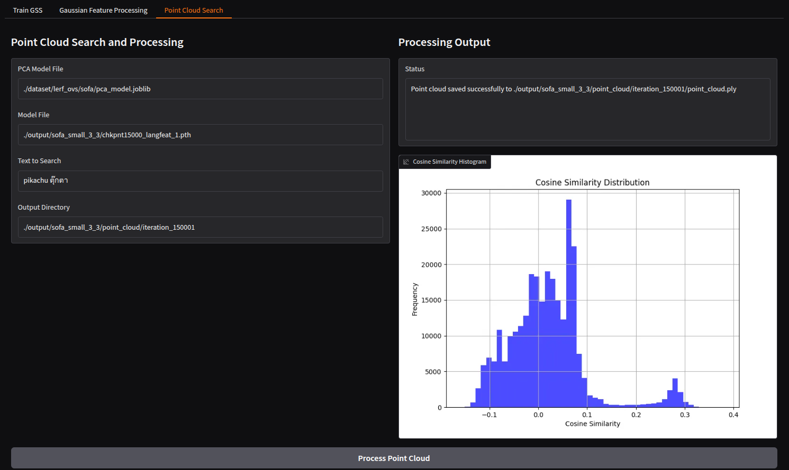

# How to Install and Run Gradio

## Installation

To install Gradio, use the following command:

```bash
pip install gradio
```

## Running Gradio in `app.py`
```bash
gradio app.py
```

# Preview
## Train GSS

## Point cloud search

### Result


# TODO
- [x] custom highlight color
